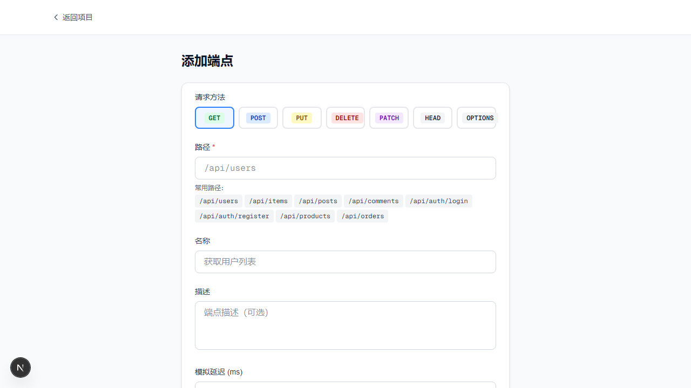
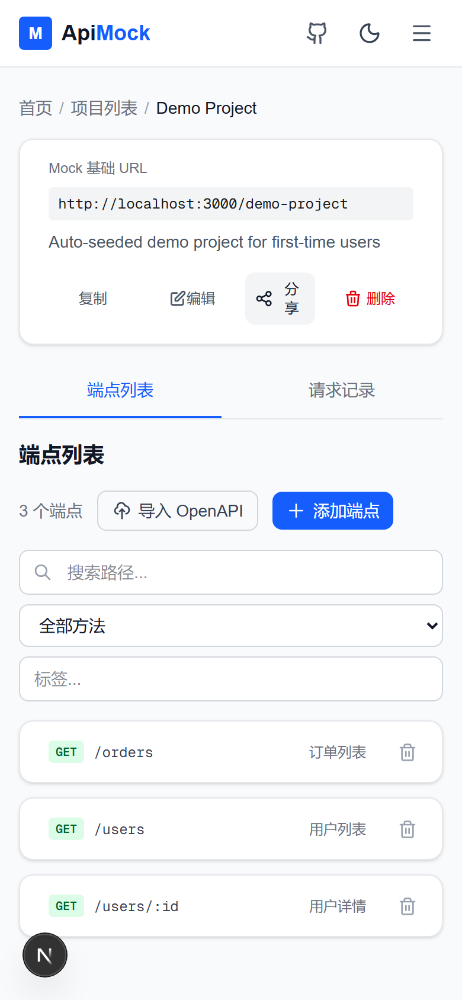

# ApiMock

English | [简体中文](./README.md)

> Describe what you need in plain language — get a shareable Mock URL in 30 seconds. AI generates semantically-correct responses. No signup, works out of the box.

[](https://apimock.up.railway.app)　[](https://github.com/laimua/apimock)　[](./LICENSE)

<!-- TODO: After deploying to Railway, replace the Live Demo URL above with your actual Railway app URL (default `<random-words>-<num>.up.railway.app`) or bind a custom domain -->



　

---

## What is this

ApiMock is a self-hosted, zero-config Mock API service for parallel frontend/backend development.

- **AI-powered Mock** — Describe what you need in natural language (Chinese or English); AI generates semantically-correct Mock data
- **OpenAPI import** — Import OpenAPI 3.0 spec, auto-create endpoints
- **Dynamic response rules** — Return different responses based on Query / Header, simulate error scenarios
- **Instant sharing** — Mock endpoints get public URLs; team members access without login
- **Per-endpoint share visibility** — Hide any endpoint from the share page without disabling the Mock URL
- **Daily AI budget** — Settings page shows today's request/token usage; auto-falls back to template generation when the limit is hit
- **Multi-provider** — OpenAI, Claude, DeepSeek, Gemini, Tongyi, Zhipu, Doubao, Moonshot, MiniMax, plus any OpenAI-compatible endpoint (Ollama / vLLM / LM Studio)
- **Zero-config startup** — Auto-seeds `demo-project` on first boot; see it working in 30 seconds

## Quick start

```bash
git clone https://github.com/laimua/apimock.git
cd apimock
pnpm install

# Required: generate encryption key (for AI provider API keys)
export ENCRYPTION_KEY=$(openssl rand -hex 32)

pnpm db:migrate   # Create schema
pnpm dev          # Start dev server
```

Open [http://localhost:3000](http://localhost:3000) — you'll see an auto-created `demo-project`.

Try the demo:

```bash
# Get user list
curl http://localhost:3000/demo-project/users

# Get single user
curl http://localhost:3000/demo-project/users/1

# Get order list
curl http://localhost:3000/demo-project/orders
```

## Tech stack

| Tech | Purpose |
|------|---------|
| [Next.js 16](https://nextjs.org/) | React full-stack framework (App Router) |
| [Drizzle ORM](https://orm.drizzle.team/) | Type-safe ORM |
| [better-sqlite3](https://github.com/WiseLibs/better-sqlite3) / [mysql2](https://github.com/sidorares/node-mysql2) | Dual database support |
| [Zod](https://zod.dev/) | API input validation |
| [Vitest](https://vitest.dev/) / [Playwright](https://playwright.dev/) | 696 unit + 119 E2E tests |
| [CodeMirror 6](https://codemirror.net/) | JSON editor |
| [Tailwind CSS v4](https://tailwindcss.com/) | UI styling |

## Deploy

### Release package (zero-dependency single machine)

Every release ships prebuilt standalone packages (`linux-x64` and `win32-x64`) on [GitHub Releases](https://github.com/laimua/apimock/releases). The server only needs **Node.js 22.x** (exactly major 22 — the better-sqlite3 native binding is ABI-locked) — no pnpm, no npm install, no Docker:

```bash
# 1. Download and extract (use the win32-x64 package on Windows servers)
tar xzf apimock-*-linux-x64.tar.gz && cd apimock-*

# 2. Configure environment
cp .env.example .env
# Edit .env:
#   ENCRYPTION_KEY=$(openssl rand -hex 32)   # keep it fixed; rotating breaks encrypted AI keys
#   MANAGE_TOKEN=<admin login password, 20+ random chars>
#   ADMIN_TOKEN=<backup API token, 20+ random chars, different from MANAGE_TOKEN>
export $(grep -v '^#' .env | xargs)

# 3. Initialize the database (idempotent; run again on upgrades)
node migrate.mjs

# 4. Start (listens on 0.0.0.0:3000, override with PORT)
node server.js
```

Verify: `curl http://localhost:3000/api/health` returns `{"status":"ok",...}`; open `/projects` in a browser and log in with `MANAGE_TOKEN`.

> Note: packages are platform-specific (better-sqlite3 native binding) — download the one matching your server (`linux-x64` / `win32-x64`). For other platforms, build your own with `pnpm package:standalone` on a machine matching the target OS/arch. On Windows servers, configure process supervision via Services / NSSM (systemd is Linux-only).

Process supervision (systemd), backup cron, and upgrade steps are in the "Standalone package" section of [docs/DEPLOY.md](./docs/DEPLOY.md).

### Railway (recommended)

```bash
# 1. Fork this repo to your GitHub
# 2. On railway.app, create a new project linked to your GitHub repo
# 3. Set env vars:
#    SQLITE_PATH=/data/apimock.db
#    ENCRYPTION_KEY=<openssl rand -hex 32>
# 4. Railway auto-builds and deploys
```

Full deployment docs (MySQL path, Fly.io, local Docker) in [docs/DEPLOY.md](./docs/DEPLOY.md).

## AI provider config

Pick one:

1. **UI (recommended)**: Visit `/settings/ai`, add provider + API key
2. **Env var**: Set `OPENAI_API_KEY` to use OpenAI

API keys are encrypted with AES-256-GCM (per-key salt).

## Project structure

```
src/
├── app/
│   ├── api/                 # Backend API
│   │   ├── ai/              # AI generate + provider management
│   │   ├── projects/        # Project + endpoint CRUD + OpenAPI import
│   │   ├── share/           # Share links
│   │   └── health/          # Health check
│   ├── projects/            # Project management UI
│   ├── settings/            # AI settings UI
│   ├── share/               # Share page UI
│   └── [project]/[...path]/ # Mock service dynamic route
├── components/              # React components
└── lib/
    ├── db.ts                # DB driver selection (sqlite/mysql) + isMysqlEnv()
    ├── db-sqlite.ts         # SQLite driver
    ├── db-mysql.ts          # MySQL driver
    ├── db-transaction.ts    # Dual-stack transaction util (sqlite sync / mysql async)
    ├── db-error.ts          # Unique-constraint detection (cross-driver)
    ├── ai-errors.ts         # AI provider error handling (leak-safe)
    ├── schema-sqlite.ts     # SQLite Drizzle schema
    ├── schema-mysql.ts      # MySQL Drizzle schema
    ├── kv-store.ts          # KV abstraction (in-memory / Redis backends)
    ├── rate-limit.ts        # Fixed-window rate limiter (via kv-store)
    ├── body-size-limit.ts   # 1MB body guard
    ├── mock-response-selector.ts # Runtime response selection (query/header rule matching)
    ├── demo-seed.ts         # Auto-seed demo-project
    ├── encryption.ts        # AES-256-GCM encryption
    ├── ssrf.ts              # SSRF protection
    └── analytics.ts         # Plausible custom events
```

## Tests

```bash
pnpm test                      # Unit + integration (696 cases)
pnpm exec playwright test      # E2E (119 cases)
pnpm test:coverage             # Coverage report
pnpm ci:local                  # Reproduce CI locally (install → build → playwright)
```

> **Gating discipline**: run tests against a clean DB (`SQLITE_PATH=/tmp/clean-test.db`) to avoid stale-table false greens from the production db; run both the main `tsc` and the test `tsc` (`tsconfig.test.json`). See [AGENTS.md](./AGENTS.md) "Tests & gates".

## Environment variables

Full list in [.env.example](./.env.example). Key variables:

| Variable | Required | Description |
|----------|----------|-------------|
| `ENCRYPTION_KEY` | yes | AES-256-GCM key, `openssl rand -hex 32` |
| `DB_TYPE` | no | `sqlite` (default) or `mysql` |
| `SQLITE_PATH` | no | SQLite file path, default `./data/apimock.db` |
| `MYSQL_*` | no | MySQL connection params (when `DB_TYPE=mysql`) |
| `NEXT_PUBLIC_PLAUSIBLE_DOMAIN` | no | Plausible analytics domain, empty disables |
| `SKIP_SEED` | no | `true` to disable auto-seed (for tests) |

## Code quality

The project has gone through multiple independent code-review rounds with continuous remediation:

- **Security/robustness review** (`docs/CODE-REVIEW-2026-07-25.md`): P0×1 + P1×19 + P2×55; all P0+P1 and most P2 fixed.
- **Architecture review** (`docs/ARCHITECTURE-REVIEW-CONSENSUS-2026-07-29.md`): consensus and landing of a multi-model (kimi / codex / claude / ZCode) cross-review, covering AI error leak prevention, TOCTOU detection unification, dead-dependency cleanup, etc.
- **Fully-green CI gates**: Lint + Unit (696) + Build + E2E (119); PRs must be all-green to merge.

Server error responses follow a unified shape contract (`docs/API-ERROR-SHAPE.md`); frontend/backend read/write `json.error?.message` accordingly.

## Contributing

Contributions welcome! Please read [CONTRIBUTING.md](./CONTRIBUTING.md) and the [Code of Conduct](./CODE_OF_CONDUCT.md) first.

[Report a bug](https://github.com/laimua/apimock/issues/new?template=bug_report.md) · [Suggest a feature](https://github.com/laimua/apimock/issues/new?template=feature_request.md) · [Join discussions](https://github.com/laimua/apimock/discussions)

## License

[MIT](./LICENSE) © 2026 laimua
